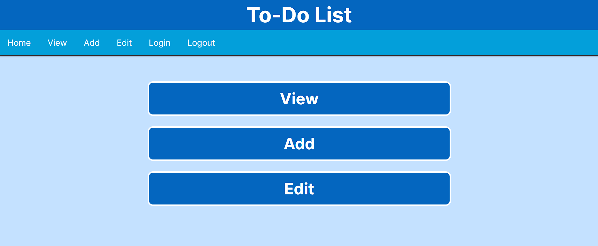
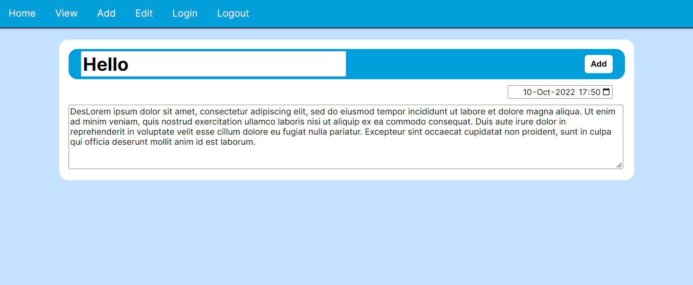
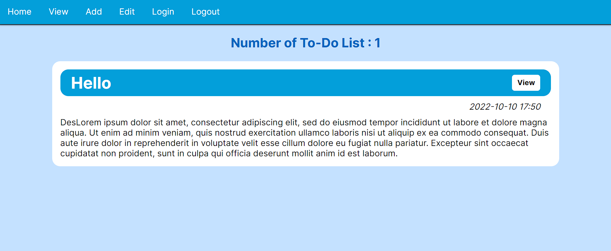
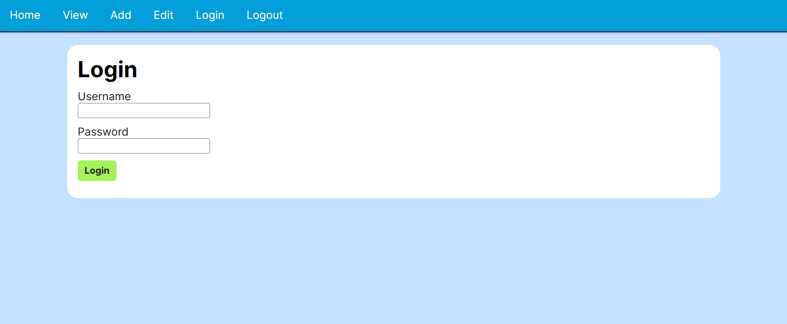
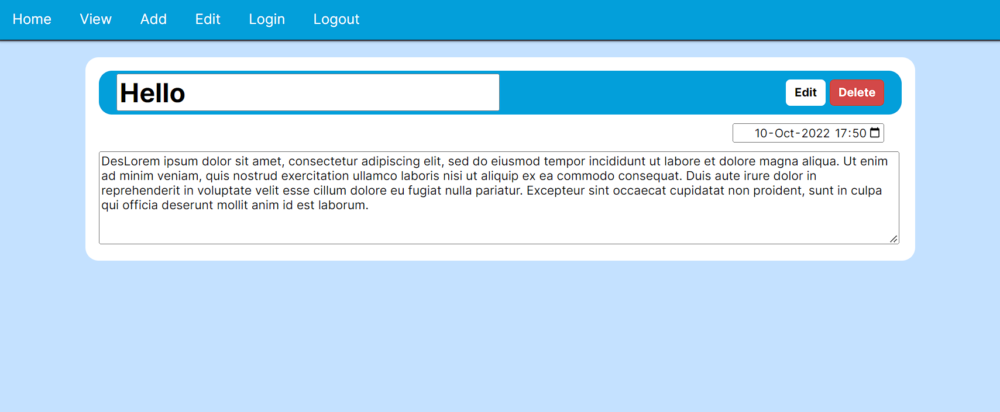

# To-Do List
To-Do List web application using EJS CSS Node.js Express.js MongoDB  

## How to use the app
Index page  
  

Add page for adding To-Do List  
  

View page for viewing To-Do List sorted by date  
  

To edit To-Do List you need to login first (username=admin, password=pass)  
  

Edit page for editing To-Do List or delete To-Do List 
  

## How to run the app
1. Download the code
2. Install MongoDB Community Server & MongoDB Compass
3. Navigate to inside the project folder on terminal
4. Run `npm install`
5. Run `npm start`
6. View the app at `http://localhost:3000/`
